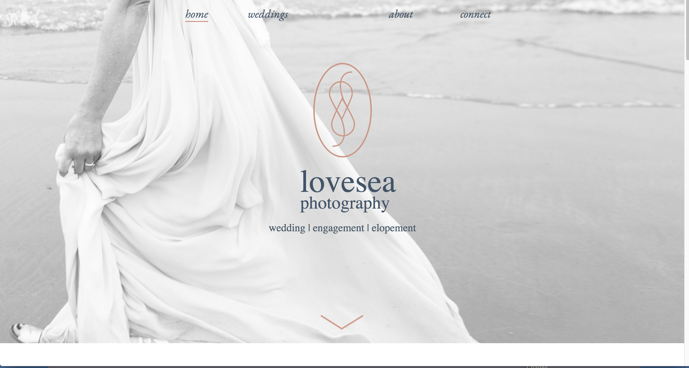
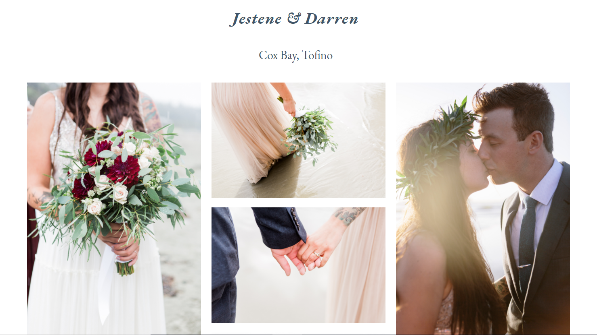

# Love Sea Wedding Photography

Wordpress site for Love Sea Wedding Photography. We are making a site!

# Project 
This is multi-page website that showcases the skills of Lovesea as a natural-light photographer in the Tofino area.

# Learning Experience
This project required us to build on exsisting skills while learning many new ones. Each team member was able to to demonstrate strong communication skills and understanding while troubleshooting obstacles thoughout the entire process. Learning a basic understanding of the Designer's process was important while merging ideas and concepts. We have all expanded our knowloedge of how to optimize the Wordpress features and by the end of this we have become a lot more comfortable and confident with this open source website creation tool.

# Technology

* Wordpress

* MAMP

* HTML5

* Gulp

* CSS3/Sass/SCSS

* Javascript

* PHP

* WordPress

* Git/Github

* eslint

## Contributors

* Shirley Zhou

* Narmeen Fazwani

* Roanne Mendoza

* Jim Bennett

* Rose Cass

## Authors

* Amelia Garvin

* Dylan Kocsis

* Breckon Trischuk 

## Installation

### 1. Download me (don't clone me!)

Then add me to your `wp-content` directory.

### 2. Rename the `Lovesea` directory

Make sure that the theme directory name is project appropriate!

### 3. Install the dev dependencies

Next you'll need to run `npm install` **inside your theme directory** next to install the node modules you'll need for Gulp, etc.

### 4. Update the proxy in `gulpfile.js`

Lastly, be sure to update your `gulpfile.js` with the appropriate URL for the Browsersync proxy (so change `localhost[:port-here]/[your-dir-name-here]` to the appropriate localhost URL).
